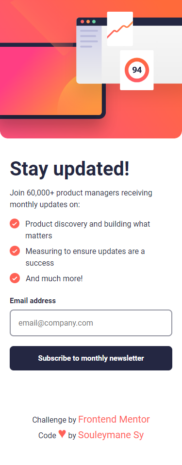
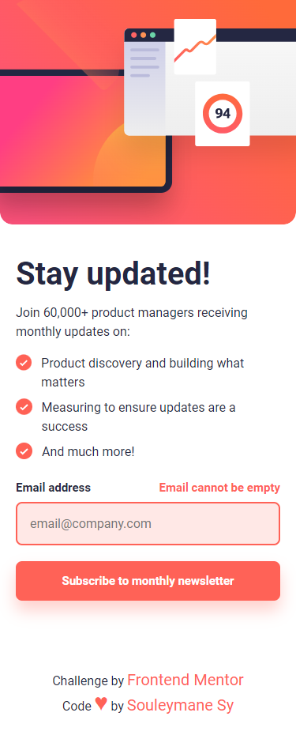
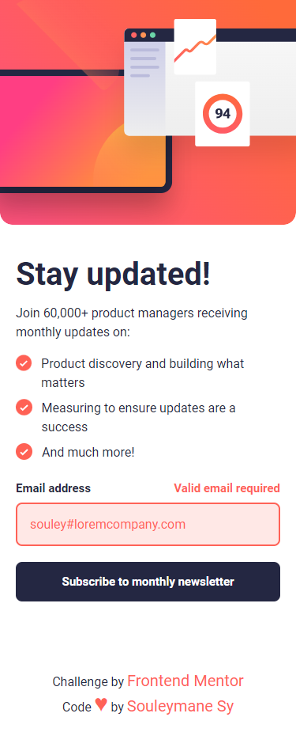
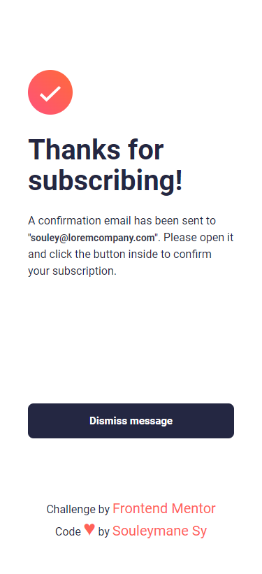
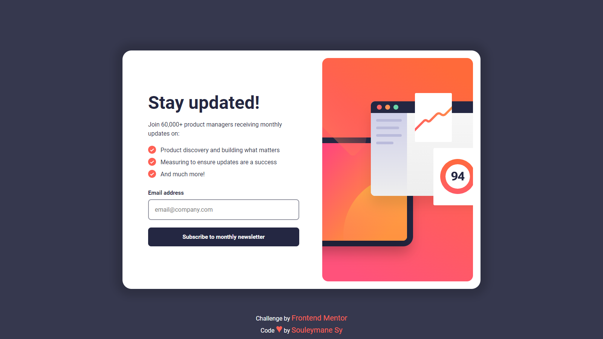
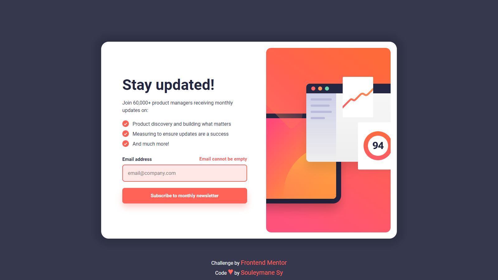
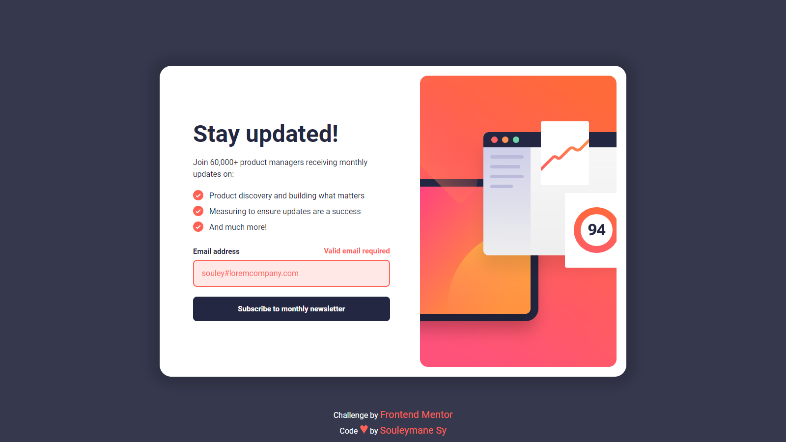
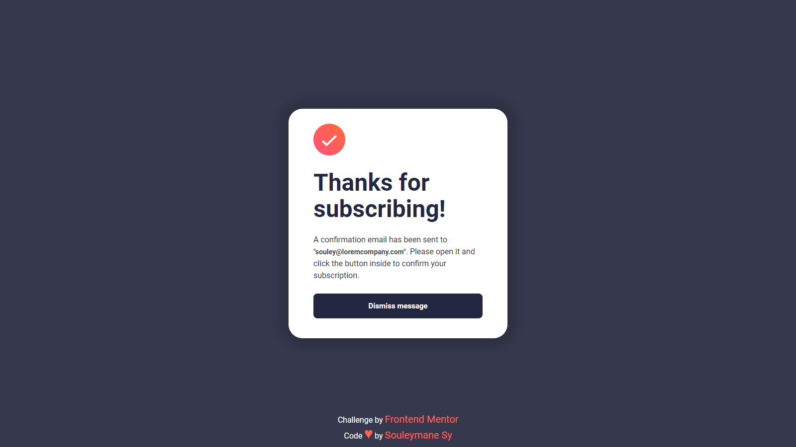

# Frontend Mentor - Newsletter sign-up form with success message

## Welcome! 👋

Thanks for checking out this front-end coding challenge.

This is a solution to the [Newsletter sign-up form with success message challenge on Frontend Mentor](https://www.frontendmentor.io/challenges/newsletter-signup-form-with-success-message-3FC1AZbNrv).

[Frontend Mentor](https://www.frontendmentor.io) challenges help you improve your coding skills by building realistic projects.

## Table of contents

- [The challenge](#the-challenge)
- [Screenshot](#screenshot)
- [My process](#my-process)
- [Built with](#built-with)
- [Author](#author)

## The challenge

The challenge is to build out this newsletter form and get it looking as close to the design as possible.

Users should be able to:

- Add their email and submit the form
- See a success message with their email after successfully submitting the form
- See form validation messages if:
  - The field is left empty
  - The email address is not formatted correctly
- View the optimal layout for the interface depending on their device's screen size
- See hover and focus states for all interactive elements on the page

## Screenshot

This is the Screenshot of my work!

### Mobile

### Mobile Errors 1

### Mobile Errors 2

### Mobile Success

### Desktop

### Desktop Errors 1

### Desktop Errors 2

### Desktop Success

## My process

Made this project with Vue 3, I Used the Composition API and GSAP for the Animation!

### Built with

- Semantic HTML5 markup
- SASS
- CSS custom properties
- Flexbox
- Mobile-first workflow
- Vue 3
- Composition API
- GSAP
- Vite
- NPM

### Links

- Solution URL: [Solution URL here](https://www.frontendmentor.io/solutions/newsletter-sign-up-vue-sass-gsap-responsive-cMXTNpmsfC)
- Live Site URL: [Live Site URL here](https://newsletter-sign-up-with-success-message-w71b.vercel.app/)

## Author

- GitHub - [Souleymane Sy](https://github.com/SouleymaneSy7)
- Frontend Mentor - [@SouleymaneSy7](https://www.frontendmentor.io/profile/SouleymaneSy7)
- Twitter - [@Souleymanesy43](https://twitter.com/Souleymanesy43)
